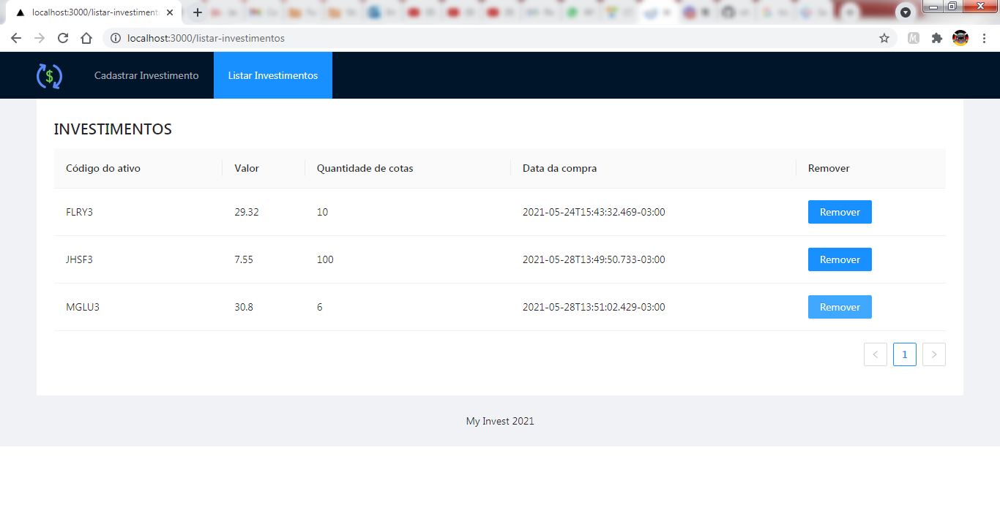

<h1 align="center">
  
</h1>

  <a href="#-tecnologias">Tecnologias</a>&nbsp;&nbsp;&nbsp;|&nbsp;&nbsp;&nbsp;
  <a href="#-projeto">Projeto</a>&nbsp;&nbsp;&nbsp;|&nbsp;&nbsp;&nbsp;
  <a href="#-layout">Layout</a>&nbsp;&nbsp;&nbsp;|&nbsp;&nbsp;&nbsp;
  <a href="#memo-licença">Licença</a>

 

  

## 🚀 Tecnologias

Esse projeto foi desenvolvido com as seguintes tecnologias:

- HTML
- SASS
- JavaScript
- Typescript
- Java
- SpringBoot
- NextJS

## 💻 Projeto

O MyInvest é uma plataforma para cadastro de investimentos pessoais, onde é possível cadastrar todos os seus investimentos e separá-los por categorias. O objetivo é que você possa realizar o controle de seus investimentos utilizando esta ferramenta. Serão necessárias melhorias como: realizar a soma de ativos por tipo de ativo tendo o controle de todos os ativos bem como cada um separadamente.

## 🔖 Layout

Você Esta aplicação não será lançada em produção, no entanto o layout é o modelo apresentado na imagem acima.
<!-- Você pode visualizar o layout do projeto através [desse link](https://www.figma.com/file/s4fytPFbDiSkv4GPSfKaLE/Jobs-Planning). É necessário ter conta no [Figma](https://figma.com) para acessá-lo. -->

## 🚀 Melhorias

Adicionado um redirecionamento na página de cadastro: ao salvar será redirecionado para a página inicial.
Foi utilizado sass para compilar o css.
O projeto foi realizado com a utilização de tipagens.
O post do campo categoria id foi resolvido!

## :memo: Licença

Esse projeto está sob a licença MIT. Veja o arquivo [LICENSE](.github/LICENSE.md) para mais detalhes.

---
## Usabilidade

Para iniciar o projeto localmente use npm run dev